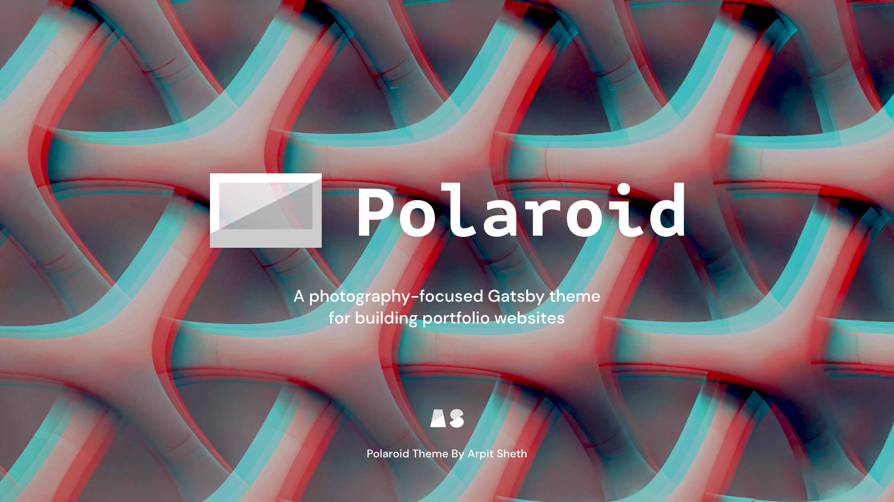

# gatsby-theme-polaroid-workspace

[](https://shetharp.github.io/gatsby-theme-polaroid/)

Polaroid is a _photography-focused_ Gatsby theme for building portfolio websites. It supports an MDX blog with tags/categories, syntax-highlighted code blocks, Theme UI for dark mode, and Typescript.

Designed & developed by [Arpit Sheth](https://arpitsheth.com/).

### [📸 View Demo Site →](https://shetharp.github.io/gatsby-theme-polaroid/)

---

### [Readme](https://github.com/shetharp/gatsby-theme-polaroid/blob/master/README.md)

- [📸 View Demo Site →](https://shetharp.github.io/gatsby-theme-polaroid/)
- [Install the Polaroid Theme](https://github.com/shetharp/gatsby-theme-polaroid/blob/master/README.md#install-the-polaroid-theme)
- [Start with the Polaroid Workspace](https://github.com/shetharp/gatsby-theme-polaroid/blob/master/README.md#start-with-the-polaroid-workspace)
- [Features](https://github.com/shetharp/gatsby-theme-polaroid/blob/master/README.md#features)
- [📖 Read Wiki Documentation →](https://github.com/shetharp/gatsby-theme-polaroid/wiki)
- [How to Contribute](https://github.com/shetharp/gatsby-theme-polaroid#how-to-contribute)

### [Add Content](https://github.com/shetharp/gatsby-theme-polaroid/wiki/Add-Content)

- [Add a new slide to the homepage](https://github.com/shetharp/gatsby-theme-polaroid/wiki/Add-a-new-slide-to-the-homepage)
- [Add a new page](https://github.com/shetharp/gatsby-theme-polaroid/wiki/Add-a-new-page)
- [Add a new blog post](https://github.com/shetharp/gatsby-theme-polaroid/wiki/Add-a-new-blog-post)

### [Customizing and Shadowing](https://github.com/shetharp/gatsby-theme-polaroid/wiki/Customizing-and-Shadowing)

- [Customize Site Metadata](https://github.com/shetharp/gatsby-theme-polaroid/wiki/Customize-Site-Metadata)
- [Customize Theme Options](https://github.com/shetharp/gatsby-theme-polaroid/wiki/Customize-Theme-Options)
- [Customize Theme UI](https://github.com/shetharp/gatsby-theme-polaroid/wiki/Customize-Theme-UI)
- [Customize the Logo](https://github.com/shetharp/gatsby-theme-polaroid/wiki/Customize-the-Logo)
- [Customize the Header Links](https://github.com/shetharp/gatsby-theme-polaroid/wiki/Customize-the-Header-Links)
- [Customize the Footer](https://github.com/shetharp/gatsby-theme-polaroid/wiki/Customize-the-Footer)

### [Features](https://github.com/shetharp/gatsby-theme-polaroid/blob/master/README.md#features)

- [Use Syntax Highlighted Code Blocks](https://github.com/shetharp/gatsby-theme-polaroid/wiki/Use-Syntax-Highlighted-Code-Blocks)

### [Developer Guide](https://github.com/shetharp/gatsby-theme-polaroid/wiki/Developer-Guide)

- [How to Contribute](https://github.com/shetharp/gatsby-theme-polaroid#how-to-contribute)
- [Deploy and Publish](https://github.com/shetharp/gatsby-theme-polaroid/wiki/Deploy-and-Publish)
- [Creating New Gatsby Theme with Typescript, MDX, and Theme-UI](https://hackernoon.com/creating-new-gatsby-theme-with-typescript-mdx-and-theme-ui-tz1c3u3u) _– Article by Arpit Sheth_

---

# Install the Polaroid Theme

1. Add the theme as a dependency to your Gatsby site.

```shell
npm i --save @shetharp/gatsby-theme-polaroid
# or
yarn add @shetharp/gatsby-theme-polaroid
```

2. Add the theme to your `gatsby-config.js` file

```js:title=gatsby-config.js
module.exports = {
  plugins: ["@shetharp/gatsby-theme-polaroid"],
};
```

3. Modify the [theme options](https://github.com/LekoArts/gatsby-themes/tree/master/themes/gatsby-theme-minimal-blog) and site metadata in your `gatsby-config.js` file.

4. Create `.mdx` files for your site's pages or posts. By default this should be in your site's `content/posts` and `content/pages` directories. You should create these directories if they don't already exist.

5. Shadow, override, and customize the theme to fit your needs. See the list of features below for more info.

# Start with the Polaroid Workspace

1. start developing your own theme using this repo as a starting point:

```shell
gatsby new gatsby-theme-custom https://github.com/shetharp/gatsby-theme-polaroid
cd gatsby-theme-custom
yarn
yarn workspace demo develop
```

_Replace `gatsby-theme-custom` with whatever you wish to name your theme._

2. The `theme` workspace directory contains the components, styles, and theme configurations.

   - You should update the `package.json` to match the details for your theme (such as name, author, repository, etc.)
   - This workspace can be used to publish your theme as its own npm package

3. The `demo` workspace directory contains the content, components, and styles for an example site that consumes the theme.

   - You should update the `package.json` to include your theme as a dependency. Make sure the name of the dependency matches the name in your theme's `package.json` file!
   - You should then update the `gatsby-config.js` to include your theme as a plugin
   - This workspace can be used to deploy a demo site for your theme

---

# Features

Under the hood, Polaroid is built on top of the functionality provided by [@lekoarts/gatsby-theme-minimal-blog-core](https://www.gatsbyjs.org/packages/@lekoarts/gatsby-theme-minimal-blog-core/). Polaroid provides additional features, especially those that enhance the user experience for a photography-focused portfolio website and blog.

Polaroid lets you quickly build a production-ready website that supports the following out of the box:

- **Photo-rich portfolio**

  - A gorgeous homepage that puts your photos or work on fullscreen display
  - Responsive optimized images
  - Automatically darkens images in dark mode
  - Customizable props for colorful gradient overlays
  - Customizable props for titles, descriptions, links, and call to action buttons
  - Beautiful typography with plenty of responsive styling for all screen sizes

- **MDX Blog Posts and Site Pages**

  - MDX support for pages and posts
  - A blog with tags/categories for posts
  - Syntax-highlighted code blocks if you want to set up a developer blog
    - Allows adding line numbers, line highlighting, language tabs, and file titles
    - Provided by [prism-react-renderer](https://github.com/FormidableLabs/prism-react-renderer) and [react-live](https://github.com/FormidableLabs/react-live)
  - Typography driven with minimal styles
  - Great reading experience with light and dark mode options

- **Built with Theme UI**

  - A custom theme with beautiful colors
  - Typography driven with minimal styles
  - Plenty of responsive styling for a great looking website on all screen sizes
  - Support for light mode / dark mode

- **Easy to Customize with Typescript**
  - Customizable `data` for the header, toggle header menu, and footer
  - Easy to import, shadow, and customize components with plenty of Typescript types defined for you

# Wiki Documentation

The Polaroid Theme wiki contains more documentation on how to add content, customize the theme, and how to use its features.

### [📖 Read Wiki Documentation →](https://github.com/shetharp/gatsby-theme-polaroid/wiki)

# How to Contribute

It will help if you have some basic experience with Yarn workspaces, Gatsby, and Gatsby themes. If you don't have much experience with this, I suggest looking into these resources:

- [What are Gatsby themes?](https://www.gatsbyjs.org/docs/themes/what-are-gatsby-themes) _– oficial documentation_
- [Building Themes](https://www.gatsbyjs.org/docs/themes/building-themes) _– oficial documentation_
- [Creating New Gatsby Theme with Typescript, MDX, and Theme-UI](https://hackernoon.com/creating-new-gatsby-theme-with-typescript-mdx-and-theme-ui-tz1c3u3u) _– Article by Arpit Sheth_

This repo uses Yarn workspaces and Gatsby, so make sure you have them installed on your machine.

1. Clone this repo and `cd` into it
2. Install dependencies
   ```shell
   yarn
   ```
3. Make changes to the theme itself in the `theme` directory. To update the demo site, make changes in the `demo` directory.
4. Launch the development server for the demo site to see your changes live.
   ```shell
   yarn workspace demo develop
   ```
5. Commit your changes to your own branch and make a PR against this repo.
   - Be sure to test your PR with a production build of the demo site.
     ```shell
     yarn workspace demo build
     ```
   - Please take a moment to update any relevant documentation in the Readme or Wiki.

Thank you for helping make this project better! 💙❤️
